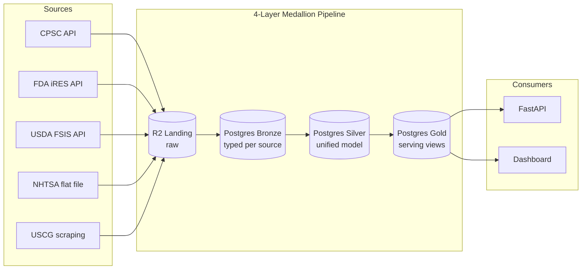

# Consumer Product Recalls

A data engineering pipeline that ingests consumer product recall data from five U.S. federal agencies, harmonizes it into a unified queryable database, and serves it via an API and consumer-facing dashboard.

This is a portfolio project demonstrating end-to-end data engineering: extraction from heterogeneous sources (REST APIs, flat files, HTML scraping), schema validation and drift handling, medallion-architecture transformations, lineage tracking, and production-grade error handling. The full reasoning behind every major design choice lives in [Architecture Decision Records](documentation/decisions/README.md).

## Architecture at a glance



The four-layer medallion shape is formalized in [ADR 0004](documentation/decisions/0004-four-layer-medallion-pipeline.md); the header/line/firm data model that lives in silver is [ADR 0002](documentation/decisions/0002-unit-of-analysis-header-line-firm.md).

## Scope

**In scope:** CPSC (Consumer Product Safety Commission), FDA (Food and Drug Administration) Enforcement Reports, USDA (Food Safety and Inspection Service), NHTSA (National Highway Traffic Safety Administration), and USCG (U.S. Coast Guard) recreational boat recalls.

**Deferred:** EPA (Environmental Protection Agency) — pending more information on whether a usable enforcement-action feed exists.

**Cut:** FAA Airworthiness Directives — target certificate holders rather than consumers.

Full scope rationale in [ADR 0001](documentation/decisions/0001-sources-in-scope.md).

## Quick start

```bash
# Clone and install
git clone <repo-url>
cd consumer-product-recalls
uv sync

# Configure environment
cp .env.example .env
# Edit .env to fill in credentials — see documentation/development.md
# for the optional direnv + Proton Pass integration

# Run the test suite
uv run pytest
```

Full local setup, including optional direnv integration and Proton Pass CLI for secret management, is in [`documentation/development.md`](documentation/development.md).

## Documentation

- [Architecture Decision Records](documentation/decisions/README.md) — every major design choice and the reasoning behind it
- [Development guide](documentation/development.md) — local setup, direnv, Proton Pass, running tests
- [Operations guide](documentation/operations.md) — secret rotation runbooks, re-ingestion procedure, cassette re-recording

## Stack

| Layer | Choice | Rationale |
|---|---|---|
| Language | Python 3.12+ | — |
| Package manager | [uv](https://github.com/astral-sh/uv) | [ADR 0017](documentation/decisions/0017-package-management-via-uv.md) |
| Schema validation | Pydantic | [ADR 0014](documentation/decisions/0014-schema-evolution-policy.md) |
| Transformation | [dbt-core](https://www.getdbt.com/) | [ADR 0011](documentation/decisions/0011-transformation-framework-dbt-core.md) |
| Warehouse | [Neon Postgres](https://neon.tech/) | [ADR 0005](documentation/decisions/0005-storage-tier-neon-and-r2.md) |
| Raw storage | [Cloudflare R2](https://www.cloudflare.com/developer-platform/r2/) | [ADR 0005](documentation/decisions/0005-storage-tier-neon-and-r2.md) |
| Orchestration | GitHub Actions cron | [ADR 0010](documentation/decisions/0010-ingestion-cadence-and-github-actions-cron.md) |
| Testing | pytest + VCR.py | [ADR 0015](documentation/decisions/0015-testing-strategy.md) |

## Status

In design phase — architecture decisions captured in ADRs 0001–0019; implementation forthcoming per [`project_scope/implementation_plan.md`](project_scope/implementation_plan.md).

## License

[MIT](LICENSE). Rationale in [ADR 0019](documentation/decisions/0019-license-mit.md).
