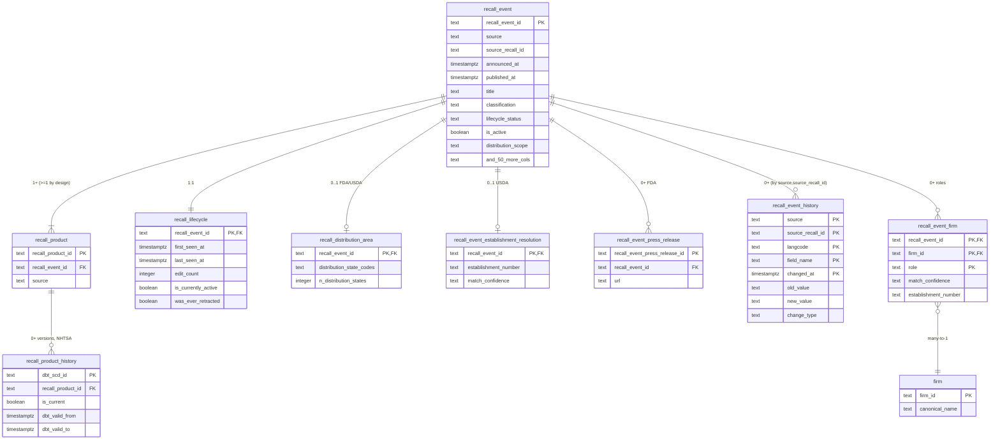

# Database overview

This is the **"understand the database content"** companion to `architecture.md` (which covers the
**integration flow** — the extract → land → bronze ingestion DAG). It catalogs the **silver** and
**gold** layers: what each table/view is, the dimensional role it plays, and how they relate.

**Scope note — silver/gold derive completely from 5 sources.** Every `recall_event.source` is from one of
`CPSC | FDA | USDA | NHTSA | USCG`. The *nine* bronze-writing extractors (the five above plus
`fda_press_releases`, `usda_establishments`, `uscg_manufacturers`, `uscg_manufacturer_details`)
belong to the **ingestion** picture in `architecture.md`. By the time data reaches silver it has been
conformed to the five canonical sources. 

Surrogate keys (`recall_event_id`, `recall_product_id`, `firm_id`) are minted in silver and **reused
verbatim** by gold — never re-keyed — so lineage is preserved end to end.

## How to read these diagrams

Diagrams are [Mermaid](https://mermaid.js.org/) fenced blocks. GitHub renders them inline; hand-edit
in [mermaid.live](https://mermaid.live). Edge
convention, used throughout:

- **`══>` thick** = a hard FK or direct model/build lineage.
- **`┄┄>` dotted** = a *soft* join (e.g. `firm` → a sidecar via `observed_company_ids`, with no hard
  FK) or a collapsed/summary lineage.
- A **faded, dashed node** = a built-but-dormant artifact (currently only `firm_fei_edges`).

## Map — every silver & gold entity (Figure 1)

`recall_event` is the hub of the core; the **firm cluster** attaches through the `recall_event_firm`
bridge table. The **Slowly-changing dimensions (SCD-2) snapshots** feed the firm/product current views; and **gold** reads silver
(serving `mart_*` one row per consumer, aggregate `fct_*` pre-grouped for dashboards). `firm_fei_edges`
is drawn faded — it is materialized but **not wired into the live firm build** (FEI-merging is
deferred/opt-in, ADR 0037; see the firm-cluster section).

```mermaid
flowchart TB
    %% ===== Legend =====
    subgraph LEGEND["Legend"]
        la["fact / dim"] ==> lb["child = FK / direct lineage"]
        lc["firm"] -.-> ld["sidecar = soft join"]
    end

    %% ===== SILVER: recall core =====
    subgraph CORE["Silver · Recall core"]
        re["recall_event"]
        rp["recall_product"]
        rph["recall_product_history"]
        rel["recall_lifecycle"]
        reh["recall_event_history"]
        rda["recall_distribution_area"]
        repr["recall_event_press_release"]
        reer["recall_event_establishment_resolution"]
        ref["recall_event_firm"]
    end

    %% ===== SILVER: firm cluster =====
    subgraph FIRM["Silver · Firm cluster"]
        firm["firm"]
        fea["firm_establishment_attributes"]
        fma["firm_manufacturer_attributes"]
        ffa["firm_fda_attributes"]
        umry["uscg_mic_reassignment_years"]
        fx[("firm_crosswalk · Python")]
        ffe["firm_fei_edges (deferred)"]
    end

    %% ===== SCD-2 history (silver_snapshots schema) =====
    subgraph SNAP["silver_snapshots · SCD-2 history"]
        s_est["firm_establishment_attributes_snapshot"]
        s_fda["firm_fda_attributes_snapshot"]
        s_uscg["uscg_manufacturer_attributes_snapshot"]
        s_nhtsa["nhtsa_recall_product_snapshot"]
    end

    %% ===== GOLD: serving marts =====
    subgraph MART["Gold · Serving marts"]
        mrs["mart_recall_summary"]
        mfp["mart_firm_profile"]
        mps["mart_product_search"]
    end

    %% ===== GOLD: aggregate facts =====
    subgraph FCT["Gold · Aggregate facts"]
        f_wk["fct_recalls_by_week"]
        f_mo["fct_recalls_by_month"]
        f_yr["fct_recalls_by_year"]
        f_tr["fct_recalls_monthly_trend"]
        f_fm["fct_recalls_by_firm"]
        f_cl["fct_recalls_by_classification"]
        f_st["fct_recall_status"]
        f_geo["fct_recalls_by_geography"]
        f_un["fct_units_recalled"]
    end

    %% recall_event is the hub of the core
    re ==> rp
    re ==> rel
    re ==> reh
    re ==> rda
    re ==> repr
    re ==> reer
    re ==> ref
    s_nhtsa ==> rp
    s_nhtsa ==> rph

    %% bridge into the firm cluster
    ref ==> firm

    %% firm cluster build + sidecars
    fx ==> firm
    firm -.-> fea
    firm -.-> fma
    firm -.-> ffa
    fma ==> umry

    %% snapshots feed the current views
    s_est ==> fea
    s_fda ==> ffa
    s_uscg ==> fma

    %% gold lineage (primary grain source shown)
    re ==> mrs
    firm ==> mfp
    rp ==> mps
    re -.-> f_mo
    firm -.-> f_fm

    %% dormant artifact
    classDef dormant opacity:0.5,stroke-dasharray:4
    class ffe dormant
```

## Silver layer

Silver is the conformed, business-modeled layer: 15 models + 4 SCD-2 snapshots (in the
`silver_snapshots` schema). It supplies the fact / dimension / bridge shapes that gold consumes —
**without** the formal `dim_`/`fct_` prefixes, which are reserved for the gold serving layer
([ADR 0038](decisions/0038-gold-layer-modeling-and-indexing-strategy.md) §2). The layer (schema)
encodes the grade; the table below names it explicitly.

### Role-grade inventory

| Silver object | Dimensional role | Grain / note |
|---|---|---|
| `recall_event` | core fact | one row per (source, source_recall_id) — the hub |
| `recall_product` | fact | one row per affected product/line |
| `firm` | conformed dimension | one row per 6b cross-source canonical firm cluster |
| `recall_event_firm` | **bridge** (M:N, role-bearing) | event ↔ firm, with `role` + `match_confidence` |
| `firm_establishment_attributes` † | SCD-2 dimension sidecar (USDA/FSIS) | current view over `…_snapshot`, anchor `establishment_number` |
| `firm_manufacturer_attributes` † | SCD-2 dimension sidecar (USCG) | current view over `uscg_…_snapshot`, anchor `mic` |
| `firm_fda_attributes` † | SCD-2 dimension sidecar (FDA) | current view over `…_snapshot`, anchor `firm_fei_num` |
| `recall_event_history` | accumulating history (field-level edits) | LAG-derived change rows |
| `recall_product_history` | SCD-2 history (NHTSA products) | Policy-C peer of the current view |
| `recall_lifecycle` | derived per-recall summary | 1:1 with `recall_event` |
| `recall_event_press_release` | event child fact (FDA) | M:1 to event |
| `recall_distribution_area` | event child fact (geography) | 1:1, FDA+USDA |
| `recall_event_establishment_resolution` | resolution map (USDA → FSIS) | 1:1 USDA |
| `uscg_mic_reassignment_years` | reference helper (MIC temporal) | MIC → current-holder-since-year |
| `firm_fei_edges` | resolution input (**dormant**) | built but not wired into the live firm build (ADR 0037) |

> **† Pending rename.** The three SCD-2 sidecars are slated for a source-uniform rename to
> `firm_{usda,uscg,fda}_attributes` (+ matching `_snapshot`s) — tracked in `implementation_plan.md`
> (Architectural follow-ups, pre-Phase-7). Names here reflect **current** deployment; this table and
> the figures below update when that branch lands.

### Recall-event core (Figure 2)

The `recall_event` hub, its `recall_product` lines, the `recall_event_firm` bridge, and the
event-child tables (history, lifecycle, press releases, distribution area, establishment resolution).

**Reading the diagram.** Crow's-foot cardinality: `||` exactly-one · `o|` zero-or-one · `o{`
zero-or-many · `|{` one-or-many. Boxes show **key columns + PK/FK badges only** — `recall_event`
shows ~10 of its ~60 columns (`and_50_more_cols` is the cue); full per-entity column contracts live in
`dbt/models/silver/_silver.yml`, [`data_schemas.md`](data_schemas.md), and
`documentation/audit/cross_source_consolidation.md`. `firm` is a stub here (PK only) — its full
cross-source cluster is **Figure 3**.

**Join keys.** Every child joins `recall_event` on **`recall_event_id`** — *except*
`recall_event_history`, which links by the **natural key `(source, source_recall_id)`** (+ `langcode`
for USDA), since it's keyed on bronze identity, not the surrogate. The bridge joins `firm` on
**`firm_id`**; `recall_product_history` joins `recall_product` on **`recall_product_id`**.

**Cardinality basis.** `recall_product` is **≥1** (referential design, `silver_design_notes.md` §2 —
USDA/USCG exactly one, others one-or-more). `recall_event_firm` is **0+**: firmless recalls exist *by
design* — USDA `no_establishment_field` (~35%, uninspected/imported products,
[`usda/establishment_join_coverage.md`](usda/establishment_join_coverage.md)), CPSC retailer-only /
non-recall announcements (~37), USCG Finding-S (~9); **never** FDA/NHTSA. See `silver_design_notes.md`
§3.

### Firm cluster + SCD-2 sidecars (Figure 3)

The conformed `firm` dimension (the 6b cross-source cluster), the `firm_crosswalk` build input, the
three per-source SCD-2 sidecars + their `silver_snapshots.*` history tables, the USCG MIC temporal
helper, and the **dormant** `firm_fei_edges`. Column-level `erDiagram` with the
`establishment_number` / `mic` / `firm_fei_num` anchors called out.

<!-- Figure 3: firm-cluster + SCD-2 erDiagram — authored next -->

## Gold layer

Gold is the consumer-shaped serving/analytics layer: **3 serving marts** (`mart_*`, denormalized
one-big-table per API consumer, materialized `table`, indexed) + **9 aggregate facts** (`fct_*`,
grain-reduced rollups, materialized `view`). The full rationale (two shapes, indexing, FTS) lives in
[`gold_design_notes.md`](gold_design_notes.md) and ADR 0038 — not repeated here.

Forward-looking gold notes also live there: the **`dim_date`** calendar dimension is **decided**
(built pre-Phase-8, no-regret), and a full **dimensional star schema** is deferred to a Phase-8 call
gated on the website's data feed — see `gold_design_notes.md` §"Deferred: a dimensional star schema".

### Gold marts + lineage (Figure 4)

The 3 `mart_*` + 9 `fct_*` with lineage edges back to their silver inputs.

<!-- Figure 4: gold marts + lineage erDiagram/flowchart — authored next -->

## See also

- `architecture.md` — the ingestion DAG (9 sources → R2 → bronze → silver → gold).
- `silver_design_notes.md` — per-model silver design rationale.
- `gold_design_notes.md` — gold shapes, indexing, FTS, the deferred star + `dim_date`.
- `dbt/models/silver/_silver.yml`, `dbt/models/gold/_gold.yml`, `dbt/snapshots/_snapshots.yml` — the
  authoritative per-column contracts.