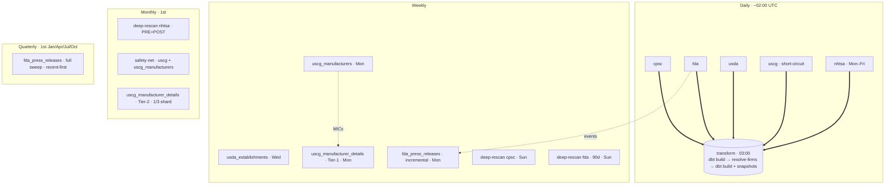

# 0010 — Ingestion cadence and orchestration via GitHub Actions cron

- **Status:** Accepted; partially superseded by [ADR 0023](0023-fda-deep-rescan-required-archive-migration-detected.md); amended 2026-05-01 (CPSC + USDA empirical findings), 2026-06-02 (Phase-7 deep-rescan cadence + GitHub-Actions hardening), and 2026-06-08 (Phase 6f.3 — full 9-source cadence + GHA compute tuning) — see "Revision note" sections at end
- **Date:** 2026-04-16

## Context

Each in-scope source has its own publication rhythm and update profile:

| Source | Publication rhythm |
|---|---|
| CPSC | New recalls posted multiple times per week |
| FDA | Weekly enforcement reports + daily product/event updates |
| USDA | Weekly publication, occasionally daily during outbreaks |
| NHTSA | Flat file refreshed daily, but slow-changing in practice |
| USCG | Low volume, ~monthly cadence |

Several orchestration patterns were considered:

- **Linux cron + bare scripts on a VM.** Cheapest in dollar terms but requires VM hosting (free-tier Oracle Cloud or similar) and self-managed observability. Adds infrastructure burden that doesn't pay portfolio dividends.
- **GitHub Actions scheduled workflows.** Free for public repos with no minute cap; private repos get 2000 minutes/month. Git-native logging and re-run UI. Secrets handled by GitHub. No external infrastructure.
- **Prefect Cloud free tier.** Managed orchestration with DAG visualization, built-in retries, observability. Adds an external dependency and a learning surface that doesn't earn its keep at v1's complexity.
- **Airflow / Dagster.** Heavyweight; require their own hosting; overkill for daily cron at this scale.

At v1's scale (5 sources, ~15K records/year ingested, no cross-source DAG dependencies until silver/gold) managed orchestration adds complexity without commensurate value.

## Decision

- **Orchestrator:** GitHub Actions scheduled workflows (cron syntax in `.github/workflows/`), one workflow per source extractor.
- **Repository visibility:** public. Secondary benefit beyond portfolio reasons — public repos have unlimited Actions minutes, while private repos are capped at 2000/month (which v1 would approach).
- **Per-source cadence:**

| Source | Cadence | Strategy |
|---|---|---|
| CPSC | daily | Incremental query on `LastPublishDate >= yesterday` (publication-time only — does NOT advance on edits; deep rescan is the edit-detection mechanism — see Revision note) |
| FDA | daily | Incremental query on `eventlmd >= yesterday` |
| USDA | daily | **Full-dump on every run** (`field_last_modified_date` is not a server-side filter — see Revision note); content-hash dedup makes re-runs cheap |
| NHTSA | weekly | Full flat file download per ADR 0008, content-hash dedup per ADR 0007 |
| USCG | weekly | HTML scrape with rate limiting and robots.txt respect |

- **Workflow isolation:** each source has its own workflow file. A USCG scraping outage does not block CPSC ingestion.
- **Runtime environment:** `ubuntu-latest`, dependencies installed via `uv` (or pip), execute the per-source extractor + bronze loader.
- **Secrets:** Neon connection string, R2 credentials, FDA API key live in GitHub Actions repository secrets.
- **Silver and gold transformation orchestration is out of scope for this ADR** and will be addressed in Phase 3 — it depends on the choice of transformation framework (dbt-core vs. plain SQL vs. other), which is itself a future ADR.

### Deep rescans — catching silent edits on weak-timestamp sources

Incremental cadence above assumes each source's last-modified timestamp advances when an existing recall is edited in place. This is explicitly documented only for FDA (`eventlmddt` and `productlmd`, with field-level history endpoints as additional evidence). For CPSC (`LastPublishDate`) and USDA (`field_last_modified_date`), agency documentation is silent or ambiguous on whether those timestamps advance on edits. A silent-edit failure mode — fields change but the timestamp does not — would cause the incremental extractor to miss the update entirely.

To guard against this, CPSC and USDA get a **secondary deep-rescan workflow** in addition to their daily incremental cron:

| Source | Primary (daily) | Deep rescan | Rationale |
|---|---|---|---|
| CPSC | `LastPublishDate >= yesterday` | Weekly full rescan of last 90 days — **mandatory** | `LastPublishDate` is publication-time only; edit detection depends on the rescan. See Revision note. |
| FDA | `eventlmd >= yesterday` | ~~None needed~~ **Weekly rescan added — see ADR 0023** | Archive migration re-touches old records; daily incremental may miss a batch on flake days |
| USDA | Full-dump on every run | N/A — the daily operation is already a full snapshot | Server-side date filter does not exist (Phase 5b Finding D); content-hash dedup handles idempotency |
| NHTSA | Weekly full flat file | N/A — the weekly operation is already a full rescan | Content hashing per ADR 0007 handles all dedup |
| USCG | Weekly full scrape | N/A — the weekly operation is already a full rescan | Same |

Deep rescans exploit the content hashing defined in ADR 0007: the rescan pulls records ignoring the watermark, and every row whose canonical content is unchanged since the prior bronze insert becomes a no-op conditional insert. Cost scales with the number of actually-edited records, not with the rescan window size.

**Rescan workflow files:** one per affected source, `.github/workflows/deep-rescan-<source>.yml`, scheduled for weekends (e.g., Sunday 04:00 UTC) to avoid colliding with daily extraction workflows or the Monday morning transform window.

**No escape hatch — both empirical verifications closed.** The original ADR allowed for relaxing or removing rescans if Phase 3 (CPSC) or Phase 5b (USDA) verification proved the timestamps reliable. Both verifications closed in the opposite direction (see Revision note). The deep rescan is now the **primary edit-detection mechanism for CPSC**, not a defense-in-depth net. USDA's deep-rescan section above no longer applies — every USDA run is already a full snapshot.

## Consequences

- Zero infrastructure cost at v1 scale. Public repo means unlimited Actions minutes.
- All pipeline runs logged in the GitHub UI with runtime, status, and per-step output. No separate observability platform needed initially.
- Re-running a failed extraction is a one-click action in the GitHub UI; manual triggering supported via `workflow_dispatch`.
- Per-source workflow isolation means failures are localized — no global pipeline failure mode.
- USDA daily polling is cheap when nothing has changed (single API call returns empty filtered result), so daily cadence costs almost nothing relative to weekly.
- Re-evaluation triggers for moving off GitHub Actions: (a) any individual workflow runtime exceeds 60 minutes consistently, (b) cross-source DAG dependencies need explicit modeling, (c) sub-hourly cadence is required (cron in GH Actions is not guaranteed to fire on time at high frequency).
- Public repo is a hard requirement for the unlimited-minutes math; if it ever needs to go private, the orchestration choice gets revisited (likely toward self-hosted runner on Oracle Cloud Always Free).

---

## Revision note — 2026-05-01 (CPSC + USDA empirical findings)

Two pieces of empirical evidence collected during Phases 3 and 5b invalidate the original "deep rescan is a relaxable defense-in-depth net" framing. Both are closed; this revision updates the per-source cadence table and the deep-rescan section to match observed reality.

### CPSC `LastPublishDate` does NOT advance on edits

Phase 3 first-extraction analysis of 1,193 bronze records over 365 days (`documentation/cpsc/last_publish_date_semantics.md`) shows a **bimodal gap distribution** with zero records between 8 days and 5 years. Edits to already-published recalls do not bump `LastPublishDate`. The only mid-life advances observed are the 709 archive-migration records (25-year gaps), which are an upstream re-processing artifact, not edits in the editorial sense.

Consequence: the daily `LastPublishDate >= yesterday` query is a **publication-time cursor only**. Detecting genuine edits to already-published CPSC recalls requires the weekly deep rescan. The rescan is no longer optional — it is the primary edit-detection mechanism for CPSC.

There is also a 20-year (2005–2024) historical gap in CPSC bronze that the incremental strategy will not reach until the upstream archive migration completes (estimated years away at ~2–3 records/day). A one-time deep rescan with `LastPublishDateStart=2005-01-01` is required before Phase 7 cron go-live to populate this. See ADR 0028 (backfill semantics) and `documentation/cpsc/last_publish_date_semantics.md` Section 3.

### USDA `field_last_modified_date` is not a server-side filter

Phase 5b first-extraction probing (`documentation/usda/recall_api_observations.md` Finding D, `documentation/usda/first_extraction_findings.md`) confirms that both naming variants — `field_last_modified_date` and `field_last_modified_date_value` — are silently ignored by the FSIS API and return the full 2,001-record dataset. There is no working incremental cursor on the recall API.

Consequence: USDA is a **full-dump source** on every run, like NHTSA and USCG. Daily cadence is still cheap (~1.6 MB compressed payload, ETag conditional-GET considered but disabled in production due to unreliable Akamai CDN behavior — see Finding N). Content-hash dedup (ADR 0007) handles idempotency. The "deep rescan" concept does not apply — every run is already a full snapshot.

The original deep-rescan-usda.yml workflow exists from Phase 5b but its operational role collapses to "the same thing as the daily incremental run" — kept for symmetry and for one-off operator triggering, but contributes no additional coverage.

### What this changes downstream

- **`implementation_plan.md`** Phase 7 line 500 ("relaxable if empirical verification shows...") — wording corrected by the same realignment that produced this revision.
- **CPSC historical backfill** is added as a pre-Phase-7 blocker in the implementation plan, formalized by ADR 0028.
- **USDA daily cadence vs. weekly cadence question** — daily is fine; the bandwidth difference between daily and weekly is small at 1.6 MB/run, and daily preserves a tighter audit trail of the (source_recall_id, langcode) presence set per ADR 0026.

---

## Revision note — 2026-06-02 (Phase-7 deep-rescan cadence + GitHub-Actions hardening)

The Phase-7 deep-rescan reliability/workload audit (`documentation/audit/deep_rescan_reliability_audit.md`; plan `project_scope/deep-rescan-reliability-plan.md`) firmed up the **deep-rescan** cadence and the workflow hardening. This refines — does not supersede — the cadence decision above.

### Per-source deep-rescan cadence (Phase-7 cron targets)

| Source | Deep-rescan cadence | Notes |
|---|---|---|
| CPSC | weekly | Primary edit-detection mechanism (2026-05-01 revision); single full-corpus query. |
| FDA | weekly, **windowed** | Rolling 90-day `eventlmd` window (ADR 0023), not full-corpus: `deep-rescan-fda.yml` resolves a blank start date to `today − 90d` so a cron fire stays delta-scoped. Full-corpus re-seed stays available behind an explicit `full_corpus` dispatch toggle. |
| NHTSA | weekly | ~21-min full PRE+POST compare today (no corpus-level short-circuit yet). Drops to seconds on no-change weeks once the inner-content-SHA pre-extract gate lands (plan W6). |
| USDA | n/a | Every run is already a full snapshot (2026-05-01 revision). |
| USCG manufacturer **details** | **quarterly** | The full ~14k-page detail sweep at the 1s polite throttle runs ~4.5–7.75h — it exceeds the GitHub-hosted 6h per-job cap, so it cannot be a single weekly job, and detail-only drift (a `Date Modified` bump with no listing change) moves slowly. Matches `project_scope/phase-5d-uscg-manufacturers-detail.md`. A **1/12 monthly rotation** is recorded as a *future option*, not adopted: it needs a `--min-id`/`--max-id` range parameter on `deep-rescan` plus a persistent per-shard offset cursor (neither exists today); the simpler interim is the quarterly full sweep or the chunked-process driver of plan W9. |

USCG manufacturer/listing (Tier-1) deep rescans follow the weekly USCG cadence; only the detail (Tier-2) sweep needs the relaxed cadence.

### GitHub-Actions hardening (landed in Tiers 1–2 of the plan)

- All `deep-rescan-*.yml` (now six, with `fda_press_releases`) carry a `concurrency` group (`cancel-in-progress: false` — a cron and a manual dispatch serialize rather than double-run) and a `timeout-minutes` bound (NHTSA 40 / CPSC 30 / USDA 30 / FDA 60; USCG-detail deliberately unbounded pending an empirical single-run time — plan W9).
- Engines are built through one `NullPool` + TCP-keepalive factory (`src/config/db.py`), and a Neon mid-transaction connection drop on the bronze load is retried (`_is_disconnect`, `src/extractors/_base.py`). Together these address the Neon connection-drop failure class the audit found (Problem 2).
- Secret validation runs **before** `uv sync` in every deep-rescan workflow, so a missing secret fails in seconds rather than after dependency install.

`schedule:` triggers remain **off** — Phase 7 turns cron on. These workflows are now cron-*ready*.

---

## Revision note — 2026-06-08 (Phase 6f.3: full 9-source cadence + GitHub-Actions compute tuning)

The Phase 6f.2 pass verified every extractor's mode against the code (`documentation/architecture.md` → *Extraction mode + deep-rescan role*). This note completes the cadence picture for **all nine** registered sources — the Decision table (line 33) and the 2026-06-02 table covered only the five recall sources — and tunes the schedule for freshness vs GitHub-Actions compute. **`schedule:` triggers stay off; Phase 7 turns them on with these targets.**

**Compute frame.** A public repo has unlimited Actions minutes, so the binding constraints are (a) the **6h per-job hard cap** and (b) this ADR's own ">60min consistently → reconsider" trigger. The design keeps the cheap, user-facing recall sources fresh **daily**, drops full-dump / short-circuit / reference sources to **weekly**, and pushes the two multi-hour sweeps to the slowest viable cadence — one of which (`uscg_manufacturer_details` Tier-2) physically cannot run as a single job (4.5–7.75h > 6h).

### Full per-source cadence (Phase-7 cron targets)

| Source | Mode | Incremental / routine | Deep-rescan / full-sweep | Notes |
|---|---|---|---|---|
| `cpsc` | cursor | **daily** | **weekly** (Sun) | deep-rescan = the *mandatory* edit-catch (`LastPublishDate` doesn't advance on edits) |
| `fda` | cursor | **daily** | **weekly** (Sun, 90-day window) | deep-rescan catches archive migration (ADR 0023) |
| `usda` | full-dump | **daily** | n/a | daily keeps the presence manifest tight (ADR 0026) |
| `usda_establishments` | full-dump | **weekly — Wed** | n/a | FSIS directory, refreshed Mon/Tue → collect Wed; reference data, no daily need |
| `nhtsa` | full-dump | **daily (Mon–Fri)** | **monthly** | file updates weekdays; routine catches modern edits — deep-rescan only re-verifies the *static* `PRE_2010` archive |
| `uscg` | short-circuit | **daily** | **monthly** safety-net | short-circuit ⇒ ~1 page/day when unchanged; safety-relevant recalls caught within a day |
| `uscg_manufacturers` | short-circuit | **weekly** | **monthly** safety-net | reference directory, slow-changing |
| `fda_press_releases` | work-list | **weekly** (after `fda`) | **quarterly** full ~25k sweep (recent-first, resumable) | Tier-3 enrichment; press releases skew to recent recalls (~1.4k populated of ~25k) |
| `uscg_manufacturer_details` | work-list, 2-tier | **weekly** Tier-1 (after listing) | **monthly 1/3 shard rotation** (full corpus / quarter) | Tier-2 whole sweep is 4.5–7.75h > 6h cap ⇒ **must** tranche |
| **transform** | dbt | **daily**, after the daily extracts | — | `dbt build` → `resolve-firms` → `dbt build` + snapshots (silver/gold + SCD-2 banking) |

### Cron grid (UTC — illustrative; times Phase-7-tunable, ordering constraints are not)

- **Daily** — `02:00 cpsc` · `02:10 fda` · `02:20 usda` · `02:30 uscg` · `02:40 nhtsa` *(Mon–Fri)* → **`03:00 transform`**
- **Weekly** — `Mon 01:00 uscg_manufacturers` → `Mon 01:15 uscg_manufacturer_details` (Tier-1) · `Mon 02:50 fda_press_releases` (incremental) · `Wed 01:00 usda_establishments` · `Sun 05:00 deep-rescan-cpsc` · `Sun 05:30 deep-rescan-fda`
- **Monthly (1st)** — `06:00 deep-rescan-nhtsa` (PRE+POST) · `06:15 deep-rescan-uscg` + `deep-rescan-uscg_manufacturers` (safety-net) · `06:30 uscg_manufacturer_details` Tier-2 (this month's 1/3 shard)
- **Quarterly (1st Jan/Apr/Jul/Oct)** — `07:00 fda_press_releases` full sweep (recent-first, resumable)
- **Ordering (not tunable — work-list deps):** `fda → fda_press_releases`; `uscg_manufacturers → uscg_manufacturer_details` — scheduled offsets (interim) or `workflow_run` chaining (target). Daily extracts must precede the `03:00` transform; the Mon/Wed weekly extracts are timed before that day's transform so they land same-day.

### Open-question resolutions (rationale)

- **NHTSA daily vs weekly → daily (Mon–Fri).** The flat file updates on weekdays; the routine POST_2010 download already catches modern edits, so daily keeps vehicle recalls fresh at modest cost (the W6 inner-content-SHA pre-extract gate will make no-change days near-instant). **Deep-rescan → monthly** (down from the 2026-06-02 weekly): it only re-verifies the *static* `PRE_2010` archive.
- **`usda_establishments` → weekly (Wed).** FSIS refreshes the directory Mon/Tue; Wednesday collection (Tue-night UTC, before the transform) lands it same-day. Reference data feeding the establishment sidecar — no daily need.
- **`uscg` recalls → daily.** The two-gate short-circuit makes a no-change day ~one page fetch, so daily is nearly free and a new (safety-relevant) boat recall is caught within a day instead of up to a week. The directory (`uscg_manufacturers`) stays weekly — slow-changing reference data.
- **`fda_press_releases` → weekly incremental + quarterly full sweep.** Press releases skew hard to recent recalls (~1.4k populated of ~25k distinct events), so the weekly work-list (recently-edited events) keeps the populated set fresh; the full sweep is a quarterly backstop run **recent-first + resumable** (the existing `FdaPressReleaseCheckpointedSeedLoader`) so the valuable recent tail is always covered first. If a quarterly run nears the cap, the documented fallback is monthly recent-**window** portions.
- **`uscg_manufacturer_details` Tier-2 → monthly 1/3 shard rotation.** A whole sweep is 4.5–7.75h, so it **cannot** be a single job at *any* cadence; monthly thirds (full corpus every quarter) is the slowest cadence that keeps each run safely under 6h while honoring the monthly preference. Detail-only drift (a `Date Modified` bump with no listing change) moves slowly, so quarterly full-corpus coverage is ample.

### Build dependencies (Phase 7, before cron-on)

- **`uscg_manufacturer_details` shard param** — `--min-id/--max-id` + a persistent per-shard offset cursor (neither exists today). Until built, the interim is the W9 chunked-process driver or operator-triggered sweeps; a single whole-sweep job is not viable (>6h).
- **`fda_press_releases` date-window param** — a `recall_initiation_dt` floor for the monthly-recent-window fallback (only if the quarterly whole-sweep proves too long). Recent-first ordering already exists.
- **Cross-source ordering** — scheduled offsets are the simple interim; `workflow_run` chaining is the robust target.

The Decision per-source cadence table (5 sources, line 33) and the 2026-06-02 deep-rescan table are **superseded by the 9-source table above** for the Phase-7 targets; both are retained as historical record.

